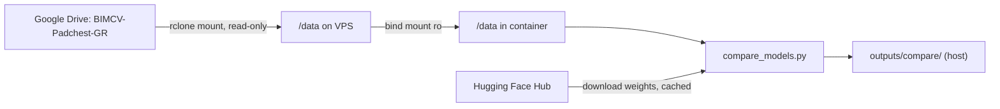

# RX — Chest X-ray Grounded Report Model Comparison

Compare three medical vision-language models on the **PadChest-GR** dataset for
grounded radiology report generation, scoring predicted bounding boxes against
ground truth (IoU, recall@0.3, recall@0.5):

| Key | Model | HF repo |
|-----|-------|---------|
| `cure` | CURE (MedGemma-4B + LoRA) | [`pamessina/medgemma-4b-it-cure`](https://huggingface.co/pamessina/medgemma-4b-it-cure) |
| `maira2` | MAIRA-2 (7B) | [`microsoft/maira-2`](https://huggingface.co/microsoft/maira-2) |
| `medgemma15` | MedGemma 1.5 (4B) | [`google/medgemma-1.5-4b-it`](https://huggingface.co/google/medgemma-1.5-4b-it) |

The script loads the models **sequentially** (one at a time), so you only need
enough VRAM for the largest single model, not all three at once.

---

## What you get

Running the container produces, in `outputs/compare/`:

- `report.md` — **the complete, thesis-ready report**: reproducibility metadata,
  headline metrics, precision/recall/F1 (micro + macro), per-pathology breakdown,
  embedded plots, and a per-image appendix with each model's text + scores
- `plots/` — bar charts: mean IoU (±std), precision/recall/F1@0.5, recall@0.3 vs
  0.5, hallucination rate, latency
- `comparison_results.json` — full raw log: reports, boxes, per-finding IoU,
  per-image scores, `thesis_metrics`, and run metadata
- `comparison_summary.csv` — per-model headline table (mean IoU micro/macro/std,
  P/R/F1@0.5, recall@0.3, hallucination rate, latency, box counts)
- `per_image/compare_<id>.png` — side-by-side panels (green = ground truth, colored = each model's boxes)
- `run.log` — full stdout/stderr transcript of the run (timing, warnings, errors)

### Metrics reported (per model)

- **Detection:** precision, recall, F1 at IoU >= 0.3 and >= 0.5, both micro
  (pooled over all boxes) and macro (mean of per-image scores, with std dev)
- **Localization:** mean IoU of matched boxes (micro + macro + std)
- **Hallucination rate:** fraction of predicted boxes with no ground-truth match
- **Per-pathology:** recall@0.5 and mean best IoU for each PadChest-GR label
- **Efficiency:** average inference latency per image

---

## Recommended hardware (Vast.ai)

| Resource | Minimum | Recommended |
|----------|---------|-------------|
| GPU VRAM | 16 GB (with `USE_4BIT=1`) | **24 GB — 1× RTX 4090** |
| Disk | 60 GB | **80 GB** (OS + env + ~31 GB model cache) |
| System RAM | 16 GB | **32 GB** |

The **dataset is not stored on the VPS disk** — it streams from Google Drive via
an `rclone` mount (see below), so you don't need 36 GB of extra disk for images.

---

## Security note

This is a **public** repo. It contains **no secrets**:

- Your Hugging Face token goes in a local `.env` file (git-ignored).
- Your Google Drive OAuth token lives only in `rclone.conf` on the VPS (git-ignored).
- The dataset and model weights are never committed.

Never paste tokens into tracked files. `.gitignore` blocks `.env`, `HF_TOKEN`,
`rclone.conf`, the dataset, and model weights as a safety net.

---

## Recommended: run on Vast.ai (PyTorch template, no Docker)

A Vast.ai instance is **already a container**, so running the script directly on
the **PyTorch** template is simpler and more reliable than Docker-in-Docker.
This is the recommended path for Vast.

### 1. Rent an instance
- Template: **PyTorch (Vast)** — or **PyTorch NGC** (both have CUDA + PyTorch + SSH)
- GPU: **1× RTX 4090 (24 GB)**
- Disk: **~80 GB**

### 2. Clone, configure token, get the data
```bash
git clone https://github.com/afshinesmaeilzad/RX.git
cd RX

export HF_TOKEN=hf_xxx        # accept the 3 model licenses on HF first

# Dataset: either mount Google Drive read-only...
GDRIVE_SUBPATH="PadChest/extracted/BIMCV-Padchest-GR" ./scripts/setup_gdrive.sh
# ...or point DATA_DIR at a local copy you downloaded.
```

### 3. Run it (one command)
```bash
# Dry run first (2 images, verifies all 3 models):
DATA_DIR=/data N_IMAGES=2 ./scripts/run_vast.sh

# Full thesis run:
DATA_DIR=/data N_IMAGES=200 ./scripts/run_vast.sh
```

`scripts/run_vast.sh` installs the extra deps (torch already ships with the
template), checks your token/data, prints the GPU, and runs the comparison.
Results land in `outputs/compare/` (see [What you get](#what-you-get)).

> If `bitsandbytes` errors on a newer CUDA, disable 4-bit (a 24 GB card fits
> MAIRA-2 in bf16 anyway): `USE_4BIT=0 DATA_DIR=/data N_IMAGES=2 ./scripts/run_vast.sh`

---

## Alternative: run with Docker

Use this on your own machine or any host with Docker + the NVIDIA Container
Toolkit (not typically needed on Vast).

### 1. Rent an instance
- Template: **PyTorch** (or any CUDA 12.1+ image with the NVIDIA Container Toolkit)
- GPU: **1× RTX 4090 (24 GB)**
- Disk: **~80 GB**
- Make sure **Docker + NVIDIA runtime** are available (the PyTorch templates have them).

### 2. Clone this repo on the instance
```bash
git clone https://github.com/afshinesmaeilzad/RX.git
cd RX
```

### 3. Configure secrets locally (never committed)
```bash
cp .env.example .env
nano .env         # set HF_TOKEN=hf_xxx  and (later) DATA_DIR_HOST
```
Accept the model licenses once while logged in to Hugging Face:
- https://huggingface.co/pamessina/medgemma-4b-it-cure
- https://huggingface.co/microsoft/maira-2
- https://huggingface.co/google/medgemma-1.5-4b-it

### 4. Mount the dataset from Google Drive
The container reads the dataset from `/data`. Provide it via `rclone`:

```bash
# One-time interactive setup of a Drive remote named "gdrive":
rclone config          # see scripts/setup_gdrive.sh header for the exact answers

# Mount your Drive folder read-only to /data:
GDRIVE_SUBPATH="PadChest/extracted/BIMCV-Padchest-GR" ./scripts/setup_gdrive.sh
```

`/data` must contain:
```
/data/grounded_reports_20240819.json
/data/Padchest_GR_files/               # the .png chest X-rays
```

Then point the compose file at it:
```bash
echo "DATA_DIR_HOST=/data" >> .env
```

> Prefer a local copy instead of Drive? Just `rclone copy` (or `gdown`) the files
> into a folder and set `DATA_DIR_HOST` to that path.

### 5. Build and run
```bash
docker compose build

# Quick 1-image smoke test (all three models):
N_IMAGES=1 docker compose run --rm compare

# Full run, e.g. 200 images:
N_IMAGES=200 docker compose run --rm compare
```

Results appear in `./outputs/compare/` on the host.

---

## Configuration (env vars)

Set these in `.env` or inline (`VAR=value docker compose run --rm compare`):

| Variable | Default | Meaning |
|----------|---------|---------|
| `HF_TOKEN` | — | Hugging Face read token (required for gated models) |
| `DATA_DIR_HOST` | `./data` | Host path to dataset (local copy or rclone mount) |
| `DEVICE` | `cuda` | `cuda` or `cpu` |
| `USE_4BIT` | `1` | `1` = 4-bit (fits 16 GB); `0` = bf16 (needs 24 GB) |
| `N_IMAGES` | `1` | Number of images to evaluate |
| `MODELS` | `cure,maira2,medgemma15` | Subset to run, comma-separated |

---

## Run without Compose (plain docker)

```bash
docker build -t rx-cxr-compare .

docker run --rm --gpus all \
  -e HF_TOKEN=hf_xxx \
  -e N_IMAGES=1 \
  -e DEVICE=cuda -e USE_4BIT=1 \
  -v /data:/data:ro \
  -v "$PWD/outputs:/app/outputs" \
  -v hf-cache:/root/.cache/huggingface \
  rx-cxr-compare
```

---

## Local (no Docker) quick test

For a CPU smoke test on a laptop (CURE only is realistic; MAIRA-2/MedGemma are
large):
```bash
pip install -r requirements.txt torch    # torch appropriate for your platform
HF_TOKEN=hf_xxx DEVICE=cpu N_IMAGES=1 MODELS=cure \
  DATA_DIR=/path/to/BIMCV-Padchest-GR python compare_models.py
```

---

## How Google Drive fits in



- The models come from **Hugging Face** (cached in a Docker volume).
- The **images/JSON** come from **Google Drive** via rclone — nothing large is
  stored in git or baked into the image.

---

## Notes & caveats

- `transformers` is pinned to **4.51.3** — the only version compatible with both
  MAIRA-2 (`<4.52`) and the Gemma-3 based models (`>=4.50`).
- CURE boxes are normalized to its 448×448 CLAHE input; MAIRA-2/MedGemma use the
  original image, so cross-model IoU is approximate (see comments in the script).
- **CURE troubleshooting:** use `AutoModelForImageTextToText` (not `AutoModelForCausalLM` —
  CURE needs the vision encoder). If load fails with `KeyError: ...embed_tokens.weight`,
  ensure latest `compare_models.py` (unties Gemma embeddings before PEFT load) and
  `peft==0.17.1`. Clear corrupt cache:
  `rm -rf ~/.cache/huggingface/hub/models--pamessina--medgemma-4b-it-cure`, rerun with
  `USE_4BIT=1`.
- MedGemma 1.5's grounded-box output is less standardized; parsing is best-effort.


